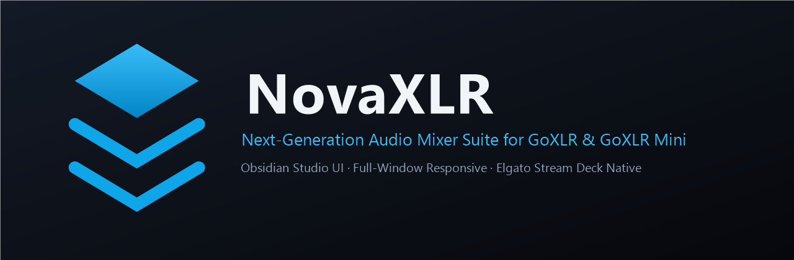



  

 

[**Download**](#-download) · [**Stream Deck Plugin**](#-elgato-stream-deck-plugin) · [**Features**](#-features) · [**Framework Credits**](#-framework-credits--acknowledgments) · [**Support**](#-support--community)

---

## 🎛️ Overview

**NovaXLR** is a modernized, next-generation audio mixer and routing controller suite for **TC-Helicon GoXLR** and **GoXLR Mini** devices on Windows. Engineered for streamers, content creators, and audio power users, NovaXLR delivers studio-grade control with a sleek Obsidian dark aesthetic, true full-window dynamic responsiveness, and native Elgato Stream Deck integration.

---

## ✨ Features

### 🎚️ Obsidian Studio UI & Glassmorphic Design
* **Refined Dark Aesthetics**: Deep obsidian backdrop (`#080a0e`), translucent glass panels, cyan/blue indicator lighting, and clean typography.
* **Modern Integrated TitleBar**: Frameless window design with brand badge, active profile indicator, integrated minimize/maximize/close controls, and live update notification pill.
* **Symmetrical System Grid**: Clean, balanced 4x2 command layout for quick access to Mic Setup, Settings, Device Options, and Updates.

### 📐 Dynamic Responsive Fluid Layout
* **Full-Window Scaling**: Edge-to-edge layout stretching cleanly across 1080p, 1440p, 4K, and ultrawide monitors without black side bars or artificial letterboxing.
* **Zero Viewport Scrollbars**: All core mixer panels, sliders, and profile managers flex dynamically to fit your screen resolution without awkward outer page scrolling.
* **Proportional Hardware Visualizer**: Real-time vector hardware visualizer that scales dynamically to window height and width.

### 🎛️ Elgato Stream Deck Native Plugin Suite
* **Zero-Latency WebSocket Control**: Communicates directly with the NovaXLR background daemon for instantaneous key action and real-time state feedback.
* **Dynamic Key Feedback**: Stream Deck button icons and text automatically update in real-time when channels are muted, faders change, or profiles switch.
* **Stream Deck + Dial Support**: Rotary encoder dial support for adjusting volume levels with continuous tactile feel and push-to-mute.

### 🔄 In-App 1-Click Update Engine
* **Automated Version Checking**: Checks GitHub Releases automatically and notifies you directly on the titlebar whenever a new release is available.
* **1-Click Download & Install**: Installs updates seamlessly right from within the application.

---

## 🎮 Elgato Stream Deck Plugin

NovaXLR includes an official Elgato Stream Deck plugin (`com.iammrwrath.novaxlr.sdPlugin`) providing full physical hardware control:

| Action | Icon | Description |
| :--- | :---: | :--- |
| **Profile Switch** | `PROFILE` | Switch directly between your custom NovaXLR profiles with live active indicator. |
| **Mic Profile Switch** | `MIC` | Swap microphone presets (Broadcast, Voiceover, Discord, Gaming). |
| **Channel Mute** | `MUTE` | Toggle mute state on any channel (Mic, Chat, Music, Game, System, etc.) with real-time red/cyan status. |
| **Fader Mute** | `FADER` | Toggle mute on physical Faders A, B, C, or D. |
| **Routing Toggle** | `ROUTE` | Dynamically toggle routing between any audio input and output matrix cell. |
| **Cough Button** | `COUGH` | Latching or momentary cough/mute button. |
| **Voice FX Preset** | `FX` | Instantly trigger Voice FX presets 1 through 6. |
| **Bleep Censor** | `BLEEP` | Trigger the swear bleep censor tone while held or toggled. |
| **Volume Control / Dial** | `VOL` | Adjust volume up/down by percentage, or use Stream Deck + dials to rotate and adjust. |

### Installing the Stream Deck Plugin
1. Download `NovaXLR.streamDeckPlugin` from the [Latest Release](https://github.com/iammrwrath/NovaXLR/releases/latest).
2. Double-click the `.streamDeckPlugin` file. Elgato Stream Deck will automatically install and activate the plugin under the **NovaXLR** category!

---

## 📲 Download

Download the latest version of NovaXLR directly from GitHub Releases:

| Package | Download Link | Description |
| :--- | :--- | :--- |
| **NovaXLR Windows Installer (Recommended)** | [⬇️ Download `NovaXLR-1.2.8.exe`](https://github.com/iammrwrath/NovaXLR/releases/latest/download/NovaXLR-1.2.8.exe) | Complete setup with desktop app, daemon, and drivers |
| **NovaXLR Stream Deck Plugin** | [⬇️ Download `NovaXLR.streamDeckPlugin`](https://github.com/iammrwrath/NovaXLR/releases/latest/download/NovaXLR.streamDeckPlugin) | Official Elgato Stream Deck plugin |

> [!TIP]
> **In-App Updates**: If you already have NovaXLR installed, simply open the app, click **Updates** (or the version chip on the titlebar), and click **Download & Install Update**!

---

## 🙏 Framework Credits & Acknowledgments

NovaXLR proudly stands on the shoulders of the open-source community. We express our deepest gratitude to the creators and maintainers of the foundational projects that made NovaXLR possible:

* **[GoXLR Utility](https://github.com/GoXLR-on-Linux/goxlr-utility)** (by **Craig McLure ([@FrostyCoolSlug](https://github.com/FrostyCoolSlug))** and the **GoXLR-on-Linux Community**):  
  The core open-source hardware reverse engineering, high-performance Rust daemon, USB communication layer, and audio routing architecture that form the bedrock of this utility.
* **[Dinnerbone](https://github.com/Dinnerbone)** and open-source contributors for essential protocol decoding and foundational work.

* **Upstream Repository**: [https://github.com/GoXLR-on-Linux/goxlr-utility](https://github.com/GoXLR-on-Linux/goxlr-utility)  
* **License**: MIT License (preserved in full in [LICENSE](LICENSE))

---

## 💬 Support & Community

* **Lead Maintainer**: [@iammrwrath](https://github.com/iammrwrath)
* **Bug Reports & Feature Requests**: [Open an Issue](https://github.com/iammrwrath/NovaXLR/issues)
* **Releases & Updates**: [GitHub Releases](https://github.com/iammrwrath/NovaXLR/releases)

---

## 📄 License

NovaXLR is licensed under the **MIT License**. See the [LICENSE](LICENSE) file for complete details.
